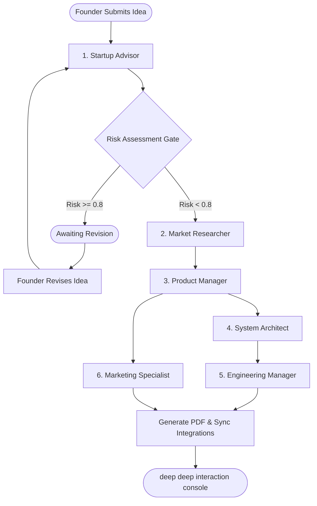

# 🌿 AI Founder Orchestration System

<p align="center">
  
  
  
  
</p>

An advanced, multi-agent AI pipeline designed to guide founders from a raw startup idea to a fully structured, ready-to-build project. The system orchestrates six specialised AI agents operating in parallel-branching paths (after the Product Manager step) with a **human-in-the-loop gate interrupt** for risk control, producing custom PRDs, database architectures, issues backlogs, promotional copies, and compiled PDF reports.

---

## 🗺️ System Architecture

The workflow is managed as a stateful graph using **LangGraph**, executing agents through a parallel-branching pipeline and saving intermediate artifacts and decision logs to a local SQLite database.



---

## 👥 Meet the Agents in Detail

### 1. 💡 Startup Advisor
*   **Core Mission**: Acts as the initial filter and risk gatekeeper. It evaluates the founder's raw concept for feasibility, market saturation, and potential execution bottlenecks.
*   **LLM Model**: Groq (configurable via `ADVISOR_MODEL`, falls back to `GROQ_MODEL` or default `llama-3.3-70b-versatile`) via `ADVISOR_API_KEY` (or generic `GROQ_API_KEY`).
*   **Processing Logic**: Evaluates key parameters such as value proposition complexity, resource constraints, and regulatory hurdles. Calculates a float-based risk score. If the risk score is high (threshold $\ge 0.6$) or if critical red flags are present, it triggers a system interrupt.
*   **Output Schema (`ValidationResult`)**:
    *   `verdict` (string): The summary assessment (e.g., "Approved", "Needs Revision").
    *   `risk_score` (float): Value between `0.0` (no risk) and `1.0` (extreme risk).
    *   `reasoning` (string): Deep architectural or business justification for the verdict.
    *   `red_flags` (list of strings): List of specific hurdles or structural concerns.

### 2. 🔍 Market Researcher
*   **Core Mission**: Gathers real-time external competitive intelligence to ground the startup idea in current market realities.
*   **LLM Model**: Groq (configurable via `RESEARCHER_MODEL`, falls back to `GROQ_MODEL` or default `llama-3.3-70b-versatile`) via `RESEARCHER_API_KEY` (or generic `GROQ_API_KEY`).
*   **Tools**: **Tavily Search API** tool (`tools/tavily.py`) executing direct search payloads.
*   **Processing Logic**: Automatically triggers search queries focusing on competitors and industry trends. Receives search results, parses the raw webpage content, estimates the Total Addressable Market (TAM), identifies top players, and filters credible sources.
*   **Output Schema (`MarketResearchReport`)**:
    *   `tam_estimate` (string): Estimated market size based on research metrics.
    *   `competitors` (list of objects): Competitors list, where each object contains `name`, `description`, and `url`.
    *   `trends` (list of strings): Core macro/micro trends observed in the space.
    *   `sources` (list of strings): List of validated URLs cited in the research.

### 3. 📋 Product Manager
*   **Core Mission**: Synthesizes the core startup concept and the competitor landscape research into a foundational product specification.
*   **LLM Model**: Google Gemini (configurable via `PM_MODEL`, falls back to `GEMINI_MODEL` or default `gemini-2.5-flash`) via `PM_API_KEY` (or generic `GEMINI_API_KEY`).
*   **Processing Logic**: Matches features against identified market gaps. It drafts user stories, prioritizes features, and builds a phased timeline.
*   **Output Schema (`PRD`)**:
    *   `problem_statement` (string): A clear, concise statement of the problem being solved.
    *   `user_stories` (list of strings): Standard user story templates defining feature value.
    *   `features` (list of objects): Feature items containing `name`, `description`, and `priority` (High/Medium/Low).
    *   `roadmap_phases` (list of objects): Phased release plan containing phase `name` and list of roadmap `items`.

### 4. 📐 System Architect
*   **Core Mission**: Designs the technical foundation for the product specified in the PRD, generating concrete schemas and interface contracts.
*   **LLM Model**: Nvidia NIM (configurable via `ARCHITECT_MODEL`, falls back to `NVIDIA_NIM_MODEL` or default `nvidia/llama-3.1-nemotron-70b-instruct`) via `ARCHITECT_API_KEY` (or generic `NVIDIA_NIM_API_KEY`).
*   **Processing Logic**: Analyzes the PRD's features list, translates them into standard relational database models, structures API endpoint contracts, and compiles system design notes.
*   **Output Schema (`ArchitectureSpec`)**:
    *   `db_schema_sql` (string): Valid DDL SQL script specifying tables, constraints, and relationships.
    *   `db_schema_mermaid` (string): Diagram written in Mermaid.js ER notation for visual rendering.
    *   `api_endpoints` (list of objects): Standard REST endpoints containing `method`, `path`, and `description`.
    *   `system_design_notes` (string): Technical recommendations regarding caching, architecture patterns, and integrations.

### 5. ⚙️ Engineering Manager
*   **Core Mission**: Deconstructs technical specifications into actionable development cycles, issue logs, and automated repository boards.
*   **LLM Model**: Groq (configurable via `EM_MODEL`, falls back to `GROQ_MODEL` or default `llama-3.3-70b-versatile`) via `EM_API_KEY` (or generic `GROQ_API_KEY`).
*   **Tools**: **GitHub REST API** integration (`tools/github.py`) for automated issue synchronization.
*   **Processing Logic**: Creates a list of standard developer tasks, categorizes them with tags, and maps them to development sprints. If a repository path is specified, it invokes the GitHub API client to programmatically create issues.
*   **Output Schema (`IssuesAndSprintPlan`)**:
    *   `issues` (list of objects): Issue descriptions containing `title`, `body`, and `labels`.
    *   `sprints` (list of objects): Development phases containing sprint `name` and the list of related `issue_titles`.

### 6. 📣 Marketing Specialist
*   **Core Mission**: Converts product capabilities into high-converting promotional copies and launch marketing sequences.
*   **LLM Model**: Groq (configurable via `MARKETING_MODEL`, falls back to `GROQ_MODEL` or default `llama-3.3-70b-versatile`) via `MARKETING_API_KEY` (or generic `GROQ_API_KEY`).
*   **Processing Logic**: Analyzes target users and features to write headlines, social copy, and outreach campaign copy.
*   **Output Schema (`MarketingAssets`)**:
    *   `landing_copy` (string): Hero headlines, sub-headlines, and landing page body copy.
    *   `linkedin_post` (string): A structured post ready for social media promotion.
    *   `email_campaign` (string): An email outreach sequence template targeting potential early adopters.

---

## ⚙️ How the Orchestration Pipeline Works

1.  **Intake & Initial Trigger**:
    The system is triggered via a REST request containing `session_id`, `startup_name`, `idea`, and an optional `github_repo`. This launches the LangGraph workflow.
2.  **The Human-in-the-Loop Risk Gate**:
    *   The **Startup Advisor** node evaluates the concept.
    *   If the advisor flags a `risk_score` exceeding `0.6` or lists any `red_flags`, the graph execution halts using LangGraph's `interrupt` system.
    *   The backend pauses execution and updates the session status to `awaiting_gate`.
    *   The founder is presented with a decision modal in the frontend console:
        *   **Ignored & Continued**: The state updates with `gate_decision = "continue"` and execution resumes immediately to the Market Researcher.
        *   **Revise Idea**: The founder input is updated as `gate_decision = "revise"`, setting a new `revised_idea` string. The graph loops back to re-trigger the Startup Advisor node on the new input.
3.  **Core Discovery**:
    Once the gate validation passes, the **Market Researcher** triggers Tavily's search tool. The parsed facts are sent to the **Product Manager**, who structures the formal PRD.
4.  **Asynchronous Parallel Branching**:
    After the Product Manager stage, the graph branches into two concurrent streams:
    *   **Engineering Stream**: Moves to the **System Architect** to build database models and API specs, and then to the **Engineering Manager** to generate sprints and automatically sync issues to GitHub.
    *   **Growth Stream**: Moves to the **Marketing Specialist** to generate launch copy.
5.  **Synchronization & Merge (The Join Node)**:
    Both branches merge at the **Join** node. Once all parallel tasks are complete, the session state is saved to the SQLite database. The backend automatically triggers the **PDF Report Compiler** (`tools/pdf_export.py`), using `xhtml2pdf` to render a structured PDF report containing all compiled artifacts.

---

## 📂 Project Structure

```directory
├── backend/
│   ├── main.py              # FastAPI application server & REST endpoints
│   ├── graph.py             # LangGraph workflow, nodes, and conditional routing
│   ├── models.py            # Pydantic validation schemas & state definitions
│   ├── db.py                # SQLite persistence handlers & connection life cycles
│   ├── config.py            # Configuration settings & environment variables loader
│   ├── requirements.txt     # Python backend dependencies
│   ├── test_api.py          # End-to-end integration test runner
│   └── tools/               # External modules (Tavily search, GitHub sync, Notion sync, PDF compiler)
└── frontend/
    ├── app/                 # Next.js 15 App Router pages (globals, landing, intake, tracking console)
    ├── components/          # Reusable UI components & animations (Framer Motion)
    ├── lib/                 # Next.js config utilities
    ├── package.json         # Frontend Node dependencies & scripts
    └── tsconfig.json        # Next.js TypeScript config
```

---

## ⚙️ Environment Configuration

### Required Environment Variables
Configure these variables in your deployment environment (e.g., Vercel / backend host):

```env
# Generic LLM API Keys
GROQ_API_KEY=your_groq_api_key
GEMINI_API_KEY=your_gemini_api_key
NVIDIA_NIM_API_KEY=your_nvidia_nim_api_key
TAVILY_API_KEY=your_tavily_api_key

# Agent-Specific API Key Routing (Falls back to generic keys above if empty)
ADVISOR_API_KEY=
RESEARCHER_API_KEY=
PM_API_KEY=
ARCHITECT_API_KEY=
EM_API_KEY=
MARKETING_API_KEY=

# Generic LLM Models (Defaults will be used if left blank)
GROQ_MODEL=llama-3.3-70b-versatile
GEMINI_MODEL=gemini-2.5-flash
NVIDIA_NIM_MODEL=nvidia/llama-3.1-nemotron-70b-instruct

# Agent-Specific Model Routing (Falls back to generic models above if empty)
ADVISOR_MODEL=
RESEARCHER_MODEL=
PM_MODEL=
ARCHITECT_MODEL=
EM_MODEL=
MARKETING_MODEL=

# Integration Tokens (Optional)
GITHUB_TOKEN=your_github_personal_access_token
NOTION_TOKEN=your_notion_integration_token
NOTION_DATABASE_ID=your_notion_database_id

# Server Configurations
NEXT_PUBLIC_BACKEND_URL=your_backend_deployment_url
ALLOWED_ORIGIN=your_frontend_deployment_url
```
