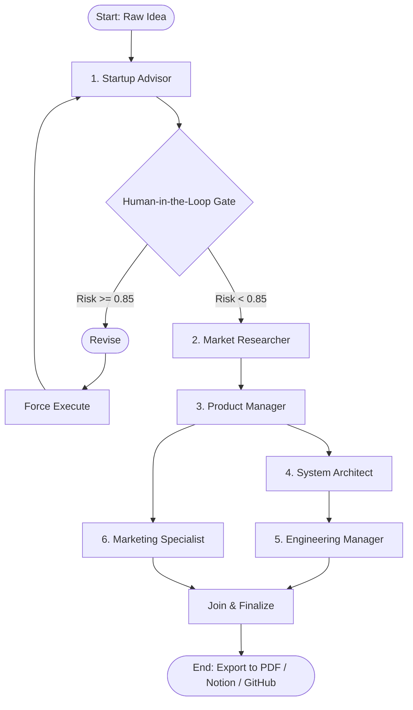

# 🧬 Blueprint.ai — AI Founder Orchestration System
*From raw prompt to investor-ready founder package in 90 seconds.*

Blueprint.ai is a stateful, multi-agent AI pipeline built to orchestrate the journey from a raw startup idea to a fully structured, ready-to-build project. By leveraging a parallel-branching path architecture and a human-in-the-loop (HITL) gate interrupt, it transforms a simple text prompt into a cohesive founder suite: VC validation reports, competitor intelligence, a Product Requirements Document (PRD), PostgreSQL schemas, development backlog sprints, promotional copy, and exportable PDF/Notion deliverables.

## 🏛️ System Architecture
The workflow is managed as a stateful graph using **LangGraph**, executing specialized agents sequentially and in parallel.

- **Execution State**: LangGraph checkpointing (local SQLite) handles pause/resume/replay logic for the HITL gate.
- **Persistent Data**: All artifacts, decision logs, and session history are permanently stored in **Supabase (PostgreSQL)**.
- **LLMOps**: All core agent logic runs exclusively on **Groq** using **Llama 3.3 70B** to deliver near-zero latency, utilizing strict prompt engineering frameworks (JTBD, MoSCoW, AIDA, PAS).



## 👥 The Agent Network

### 1. 💡 Startup Advisor (The VC Partner)
Acts as the initial filter and risk gatekeeper. Evaluates the raw concept for feasibility, market saturation, and execution bottlenecks from a Sequoia/a16z lens.
- **HITL Risk Interrupt**: If the computed risk score exceeds `0.85`, it triggers a system-level graph interrupt. The UI blurs, pausing execution until the founder chooses to bypass or revise the idea.
- **Outputs**: Verdict, risk score, primary existential threats, and actionable red flags.

### 2. 🔍 Market Researcher (The Analyst)
Pulls real-time external competitive intelligence via the **Tavily Search API** to ground the startup thesis in current market realities.
- **Outputs**: TAM/SAM/SOM estimates, 2x2 SWOT analysis, competitor weakness breakdowns, macro trends (Why Now?), and citation sources.

### 3. 📋 Product Manager (The Builder)
Synthesizes the core concept and competitor research into a ruthlessly prioritized product specification.
- **Outputs**: Customer-centric problem statement, North Star/Activation/Business success metrics, Jobs-to-be-Done (JTBD) user stories, MoSCoW prioritized feature sets, and a 2-phase release roadmap.

### 4. 📐 System Architect (The Staff Engineer)
Designs the technical foundation for the product specified in the PRD.
- **Outputs**: PostgreSQL DDL schema with relational indexing, interactive visual database diagrams (rendered via React Flow), RESTful API endpoint contracts, and system design/security notes.

### 5. ⚙️ Engineering Manager (The Scrum Master)
Deconstructs technical specifications into actionable development cycles. Automated background sync pushes issues directly to GitHub.
- **Outputs**: Context-driven issue tickets (Context + DoD + Technical Notes), Fibonacci story points, 4 dependency-ordered sprints, tech debt risks, and recommended team sizing.

### 6. 📣 Marketing Specialist (The Growth Lead)
Converts product capabilities into high-converting promotional copy and launch sequences.
- **Outputs**: Landing page copy (PAS framework), LinkedIn launch posts, urgency-driven email campaigns, a 5-step drip email sequence, Good/Better/Best pricing plans, and a 90-day GTM calendar.

## 🚀 Key Features & Integrations

- **Interactive React Flow ERD**: The Architect agent outputs raw Mermaid syntax, which the frontend parses and renders into a sleek, pan-and-zoomable, dark-mode database diagram.
- **Dynamic Multi-User Notion Auth**: Users securely input their own Notion API credentials via the UI sidebar. The backend dynamically overrides the default `.env` tokens, creating Notion pages directly in the user's workspace.
- **Stateful Pipeline Recovery**: Powered by LangGraph checkpointers, sessions can be paused at the HITL gate, resumed days later, or re-run from previous nodes without losing context.
- **Auto-Advancing UI Telemetry**: The dashboard features a YouTube-style global progress bar, "Agent Thinking..." context spinners, and auto-advancing tabs that follow the pipeline execution flow.
- **Premium PDF Compiler**: A custom xhtml2pdf engine converts the session artifacts into a 6-section, VC-grade blueprint booklet with color-coded story points, SWOT grids, and email timelines.

## 🛠️ Tech Stack

| Category | Technology |
| :--- | :--- |
| **Frontend** | Next.js 15 (App Router), TypeScript, TailwindCSS, Framer Motion, React Flow |
| **Backend** | FastAPI, Python 3, Pydantic V2, Uvicorn |
| **AI / Orchestration** | LangGraph, Groq (Llama 3.3 70B) |
| **Database / Auth** | Supabase (PostgreSQL), LocalStorage (History/Creds) |
| **Integrations** | Tavily Search API, GitHub Issues API, Notion API, xhtml2pdf |

## ⚙️ Environment Configuration

### Backend Setup
Set up a `.env` file in the `backend/` directory:

```env
# Groq API Configuration (Required)
GROQ_API_KEY=your_groq_api_key
GROQ_MODEL=llama-3.3-70b-versatile

# Supabase Configuration (Required for Persistence)
SUPABASE_URL=https://your-project.supabase.co
SUPABASE_KEY=your_supabase_anon_key

# Search Tool (Required for Market Research)
TAVILY_API_KEY=your_tavily_api_key

# GitHub Integration (Optional - Used for auto-syncing issues)
GITHUB_TOKEN=your_github_personal_access_token

# Notion Integration (Optional - Default fallback credentials)
NOTION_TOKEN=your_notion_integration_token
NOTION_DATABASE_ID=your_notion_database_id

# Server Configurations
ALLOWED_ORIGIN=http://localhost:3000
```

### Frontend Setup
Set up a `.env.local` file in the `frontend/` directory:

```env
NEXT_PUBLIC_BACKEND_URL=http://localhost:8000
```
