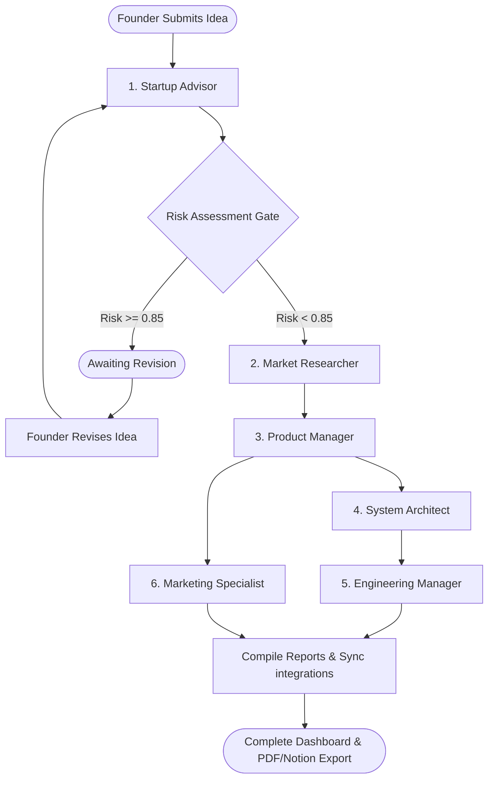

# 🧬 blueprint.ai — AI Founder Orchestration System

<p align="center">
  
  
  
  
</p>

`blueprint.ai` is a stateful, multi-agent AI pipeline designed to orchestrate the journey from a raw startup idea to a fully structured, ready-to-build project. By leveraging a parallel-branching path architecture and a **human-in-the-loop gate interrupt**, it transforms a simple text prompt into a cohesive founder package: validation reports, competitor research, a Product Requirements Document (PRD), database schemas, development backlog sprints, promotional copy, and exportable PDF/Notion deliverables.

---

## 🗺️ System Architecture

The workflow is managed as a stateful graph using **LangGraph**, executing specialized agents sequentially and in parallel, while maintaining transaction checkpoints in a local SQLite database.



---

## 👥 The Agent Network

All core agent logic runs exclusively on **Groq** using the high-performance **Llama 3.3 70B** model (`llama-3.3-70b-versatile`) to deliver production-grade outputs.

### 1. 💡 Startup Advisor
*   **Core Mission**: Acts as the initial filter and risk gatekeeper. It evaluates the raw concept for feasibility, market saturation, and execution bottlenecks from a VC partner's lens.
*   **Risk Interrupt**: If the computed risk score exceeds `0.85`, it triggers a system-level interrupt. The graph pauses execution and awaits user intervention (either to bypass/continue or to revise the idea).
*   **Outputs**: Verdict, risk score, primary existential threats, and actionable red flags.

### 2. 🔍 Market Researcher
*   **Core Mission**: Pulls real-time external competitive intelligence to ground the startup thesis in current market realities.
*   **Tooling**: Integrated with **Tavily Search API** for real-time web crawling.
*   **Outputs**: TAM/SAM/SOM estimates, competitor weakness breakdowns, macro trends, and citation sources.

### 3. 📋 Product Manager
*   **Core Mission**: Synthesizes the core startup concept and the competitor research into a prioritized product specification.
*   **Outputs**: A two-sentence user-centric problem statement, success metrics (North Star, Activation, Business), Jobs-to-be-Done user stories, MoSCoW prioritized feature sets, and a 2-phase release roadmap.

### 4. 📐 System Architect
*   **Core Mission**: Designs the technical foundation for the product specified in the PRD, generating concrete schemas and interface contracts.
*   **Outputs**: PostgreSQL DDL schema with relational indexing, visual database diagrams in Mermaid.js ER notation, restful API endpoint contracts, and system design/security notes.

### 5. ⚙️ Engineering Manager
*   **Core Mission**: Deconstructs technical specifications into actionable development cycles and issue logs.
*   **Tooling**: Automated background sync to **GitHub Issues** when a target repository is specified.
*   **Outputs**: Actionable issue tickets (Context + DoD + Technical Notes), Fibonacci story points, 4 dependency-ordered sprints, and recommended team sizing.

### 6. 📣 Marketing Specialist
*   **Core Mission**: Converts product capabilities into high-converting promotional copy and launch marketing sequences.
*   **Outputs**: Landing page copy (PAS framework), LinkedIn launch posts, email campaigns, a 5-step drip email sequence, good/better/best pricing plans, and a 90-day plan.

---

## 🚀 Key Integrations & Features

-   **Stateful Pipeline Recovery**: Powered by `LangGraph` checkpointers, sessions can be paused, resumed, or re-run from previous nodes without losing context.
-   **GitHub Integration**: Push the generated issue backlog directly to your GitHub repository automatically in the background.
-   **Notion Exporter**: Seamlessly package and sync the entire founder suite (sprints, PRD, schemas, copy) to your Notion workspace in formatted database pages.
-   **xhtml2pdf Compiler**: Generate a beautifully structured, styled, and printable PDF founder booklet directly from the session dashboard.
-   **Hover-Reveal Navigation Panel**: Modern UI sidebar providing quick access to integrations, history, and workspace settings.

---

## 📂 Project Structure

```directory
├── backend/
│   ├── main.py              # FastAPI server & REST endpoints
│   ├── graph.py             # LangGraph workflow, nodes, and routing rules
│   ├── models.py            # Pydantic schemas & state models
│   ├── db.py                # SQLite persistence and artifact handlers
│   ├── config.py            # Pydantic Settings configuration loader
│   ├── requirements.txt     # Python backend dependencies
│   └── tools/               # Tavily search, GitHub sync, Notion sync, PDF compiler
└── frontend/
    ├── app/                 # Next.js 15 pages (start page, dashboard console)
    ├── components/          # Reusable components (Sidebar, logs, panels)
    ├── lib/                 # Next.js configurations
    ├── package.json         # Node.js configurations
    └── tsconfig.json        # TypeScript configuration
```

---

## ⚙️ Environment Configuration

Set up a `.env` file in the root of the project with the following configuration:

```env
# Groq API Configuration (Required)
GROQ_API_KEY=your_groq_api_key
GROQ_MODEL=llama-3.3-70b-versatile

# Search Tool Configuration (Required for Market Research)
TAVILY_API_KEY=your_tavily_api_key

# GitHub Integration (Optional)
GITHUB_TOKEN=your_github_personal_access_token

# Notion Integration (Optional)
NOTION_TOKEN=your_notion_integration_token
NOTION_DATABASE_ID=your_notion_database_id

# Server Configurations
NEXT_PUBLIC_BACKEND_URL=http://localhost:8000
ALLOWED_ORIGIN=http://localhost:3000
```
